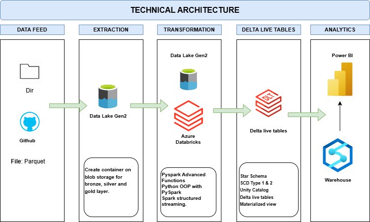

# Azure_Databricks
A guide to designing and implementing ETL on Azure with Medallion architecture, using Azure Databricks, Azure Data Factory, PySpark, Spark Streaming, Delta Live tables, SCD, and dimensional data modelling.

## Project Overview

This project involves:

1. **Data Architecture**: Designing a Modern Data Warehouse Using Medallion Architecture **Bronze**, **Silver**, and **Gold** layers.
2. **ETL Pipelines**: Extracting, transforming, and loading data from source systems in Azure Databricks using PySpark and Azure Data Factory(ADF).
3. **Data Modeling**: Developing fact and dimension tables optimized for analytical queries.
4. **Analytics & Reporting**: Creating SQL-based reports and dashboards for actionable insights on Azure Synapses connected to Azure Databricks.
5. **Governance & ACID compliance**: Implementing Unity catalog and Delta Lake on Azure Databricks.

## Architecture

The architecture for this project follows Medallion Architecture **Bronze**, **Silver**, and **Gold** layers:

## Resources
1. **Free Azure Account**: https://azure.microsoft.com/en-us/pricing/purchase-options/azure-account
2. **Azure Data Factory**: https://azure.microsoft.com/en-us/products/data-factory#Resources-6
3. **Delta live table**: https://www.databricks.com/discover/pages/getting-started-with-delta-live-tables
4. **Slowly changing dimensions**: https://learn.microsoft.com/en-us/fabric/data-factory/slowly-changing-dimension-type-one
5. **Unity Catalog**: https://learn.microsoft.com/en-us/azure/databricks/data-governance/unity-catalog/

